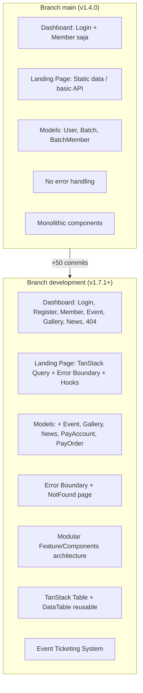

# Perbandingan Branch: `main` vs `development`

> [!NOTE]
> Branch `main` terakhir di **Release v1.4.0** (commit `543cd9e`).
> Branch `development` sudah **~50 commit di depan** `main`, dengan total **11.465 baris ditambahkan** dan **3.237 baris dihapus** di **125 file**.

---

## 1. Dependencies & Library

### NPM (package.json)

| Library | `main` | `development` | Keterangan |
|---------|--------|---------------|------------|
| `@tanstack/react-query` | ❌ | ✅ `^5.101.4` | Server state management, caching, retry |
| `@tanstack/react-table` | ❌ | ✅ `^9.0.0` | Headless table dengan sorting, filtering, pagination |
| `axios-retry` | ❌ | ✅ `^4.5.0` | Auto retry untuk request API yang gagal |
| `dayjs` | ❌ | ✅ `^1.11.21` | Date formatting (menggantikan/melengkapi date-fns) |
| `react-error-boundary` | ❌ | ✅ `^6.1.2` | Error boundary deklaratif untuk React |
| `embla-carousel-react` | ✅ `^8.6.0` | ❌ **Dihapus** | Tidak lagi digunakan |

### Composer (composer.json)

| Library | `main` | `development` | Keterangan |
|---------|--------|---------------|------------|
| `intervention/image` | ❌ | ✅ `^4.2` | Image processing server-side (resize, compress) |

---

## 2. Arsitektur Frontend — Landing Page (`FrontEnd-React-Ts`)

### Perubahan Arsitektur

| Aspek | `main` | `development` |
|-------|--------|---------------|
| **Data Fetching** | Langsung `axios.get()` di komponen | Custom hooks + TanStack Query (`useEvent`, `useGallery`, `useMember`, `useNews`, `useOrder`) |
| **API Layer** | Satu file `api-client.ts` + `api/member.ts` | Terstruktur: `api-client.ts` + file terpisah per domain (`api/event.ts`, `api/gallery.ts`, `api/news.ts`, `api/order.ts`) |
| **Error Handling** | Tidak ada error boundary | `react-error-boundary` di `main.tsx` |
| **Caching/Retry** | Tidak ada | TanStack Query retry + `axios-retry` |
| **State Management** | Local state di tiap halaman | TanStack Query sebagai server state layer |
| **Carousel** | `embla-carousel-react` | **Dihapus** |
| **Constants** | `constants/news.ts` (hardcoded data) | **Dihapus** — data dari API |

### File Baru di Landing Page

```
+ src/hooks/useEvent.ts        — Custom hook untuk fetch events
+ src/hooks/useGallery.ts      — Custom hook untuk fetch galleries
+ src/hooks/useMember.ts       — Custom hook untuk fetch members/batches
+ src/hooks/useNews.ts         — Custom hook untuk fetch news
+ src/hooks/useOrder.ts        — Custom hook untuk order ticketing
+ src/lib/api/event.ts         — API functions untuk events
+ src/lib/api/gallery.ts       — API functions untuk galleries
+ src/lib/api/news.ts          — API functions untuk news
+ src/lib/api/order.ts         — API functions untuk orders
```

### File Dihapus

```
- src/components/ui/carousel.tsx   — Embla carousel component
- src/constants/news.ts            — Hardcoded news data
```

### Halaman yang Berubah Signifikan

| Halaman | Perubahan |
|---------|-----------|
| **EventPage.tsx** | +888 baris — Sistem ticketing lengkap dengan pembelian tiket, tracking order, dan payment |
| **MemberPage.tsx** | +388/-131 — Refactor ke hooks, filter per angkatan |
| **HomePage.tsx** | +264/-185 — Redesign layout utama |
| **NewsDetailPage.tsx** | +248/-86 — Loading skeleton, error states |
| **GalleryPage.tsx** | +96/-42 — Dynamic gallery dari API |
| **NewsPage.tsx** | +126/-55 — Integrasi API penuh |
| **i18n (en.ts, id.ts)** | +133/+136 — Terjemahan baru untuk event, ticketing, order |

---

## 3. Arsitektur Frontend — Dashboard (`Inertia-React-Ts`)

### Perubahan Arsitektur

| Aspek | `main` | `development` |
|-------|--------|---------------|
| **Struktur Komponen** | Semua logika di halaman Index monolitik | Modular: `Feature/{Module}/Components/` + `Types.ts` |
| **Tabel Data** | Manual HTML table | `@tanstack/react-table` via `DataTable.tsx` reusable |
| **Halaman Error** | Tidak ada | `NotFound.tsx` + Error Boundary |
| **Registrasi** | Tidak ada | `Pages/Auth/Register.tsx` baru |

### Modul Dashboard Baru

#### 🎫 Event & Ticketing System (Completely New)

```
+ Pages/IndexEvent.tsx                              — Halaman utama (595 baris)
+ Pages/Feature/Event/Types.ts                      — Type definitions
+ Pages/Feature/Event/Components/
    ├── AccountDeleteDialog.tsx                      — Dialog hapus akun pembayaran
    ├── AccountFormModal.tsx                         — Form CRUD akun pembayaran
    ├── AccountTable.tsx                             — Tabel akun pembayaran
    ├── DataTable.tsx                                — Reusable data table
    ├── EventDeleteDialog.tsx                        — Dialog hapus event
    ├── EventDetailSheet.tsx                         — Detail event slide panel
    ├── EventFormModal.tsx                           — Form CRUD event (250 baris)
    ├── EventTable.tsx                               — Tabel event dengan sorting/filter
    ├── OfflineOrderModal.tsx                        — Modal order offline (226 baris)
    ├── OrderDeleteDialog.tsx                        — Dialog hapus order
    ├── OrderDetailSheet.tsx                         — Detail order slide panel
    ├── OrderStatusModal.tsx                         — Modal update status order
    └── OrderTable.tsx                               — Tabel order (271 baris)
```

#### 🖼️ Gallery Management (New)

```
+ Pages/IndexGallery.tsx                            — Halaman utama gallery (139 baris)
+ Pages/Feature/Gallery/Types.ts                    — Type definitions
+ Pages/Feature/Gallery/Components/
    ├── DeleteDialog.tsx                             — Dialog hapus gallery
    ├── FormModal.tsx                                — Form CRUD gallery
    └── Table.tsx                                    — Tabel gallery
```

#### 📰 News Management (New)

```
+ Pages/IndexNews.tsx                               — Halaman utama news (70 baris)
+ Pages/Feature/News/Types.ts                       — Type definitions
+ Pages/Feature/News/Components/
    ├── DeleteDialog.tsx                             — Dialog hapus news
    ├── Form.tsx                                     — Form CRUD news (244 baris)
    └── Table.tsx                                    — Tabel news
```

#### 👥 Member Management (Refactored)

```
~ Pages/IndexMember.tsx                             — Refactored: 1580 baris berubah (dipecah ke komponen)
+ Pages/Feature/Member/Types.ts                     — Type definitions
+ Pages/Feature/Member/Components/
    ├── BatchDeleteDialog.tsx                        — Dialog hapus angkatan
    ├── BatchFormModal.tsx                           — Form CRUD angkatan
    ├── BatchTable.tsx                               — Tabel angkatan
    ├── MemberDeleteDialog.tsx                       — Dialog hapus anggota
    ├── MemberDetailSheet.tsx                        — Detail anggota slide panel
    ├── MemberFormModal.tsx                          — Form CRUD anggota (376 baris)
    └── MemberTable.tsx                              — Tabel anggota (364 baris)
```

#### 🔧 Shared Components (New/Updated)

```
+ Components/DataTable.tsx                          — Reusable TanStack table wrapper (202 baris)
~ Components/ThemeProvider.tsx                       — Updated theme handling
~ Layouts/AppLayout.tsx                              — Updated layout structure
~ Layouts/AppSidebar.tsx                             — Major refactor (580 baris berubah)
~ Layouts/Header.tsx                                 — Enhanced header (214 baris berubah)
+ Pages/NotFound.tsx                                 — Error page + Error Boundary
+ Pages/Auth/Register.tsx                            — Registrasi user baru (313 baris)
```

---

## 4. Backend (Laravel)

### Controller Baru

| Controller | Fungsi | Baris |
|------------|--------|-------|
| `EventController` | CRUD Event, Order, Payment Account | 230 |
| `GalleryController` | CRUD Gallery + Cloudinary upload | 95 |
| `NewsController` | CRUD News + Cloudinary upload | 86 |
| `RegisterController` | Registrasi user baru | 105 |
| `Api/ContentController` | Public API untuk landing page | 127 |

### Service Layer Baru

| Service | Fungsi | Baris |
|---------|--------|-------|
| `EventService` | Business logic event + image upload | 137 |
| `GalleryService` | Business logic gallery | 81 |
| `NewsService` | Business logic news | 100 |
| `OrderService` | Business logic ticketing & orders | 86 |

### Model Baru

| Model | Tabel Database |
|-------|---------------|
| `Event` | `events` — Manajemen event/acara |
| `Gallery` | `galleries` — Manajemen galeri foto |
| `News` | `news` — Manajemen berita |
| `PayAccount` | `pay_accounts` — Akun pembayaran |
| `PayOrder` | `pay_orders` — Pesanan tiket |

### Database Migrations Baru

```
+ create_galleries_table        — Tabel galeri (title, image, is_active, dll)
+ create_news_table             — Tabel berita (title, content, slug, image, dll)
+ create_events_table           — Tabel event (title, date, price, ticket, status, dll)
+ create_pay_accounts_table     — Tabel akun pembayaran
+ create_pay_orders_table       — Tabel order tiket (status, qty, payment_proof, dll)
~ create_batch_members_table    — Ditambah 2 kolom baru
```

### Routes Baru

#### `web.php` (+48 baris)

```php
// Dashboard routes baru:
Route::resource('events', EventController::class)     // CRUD Event
Route::resource('orders', ...)                         // CRUD Order
Route::resource('accounts', ...)                       // CRUD Payment Account
Route::resource('galleries', GalleryController::class) // CRUD Gallery
Route::resource('news', NewsController::class)         // CRUD News
Route::any('{any}')                                    // Fallback 404
```

#### `api.php` (+15 baris)

```php
// Public API routes baru:
GET /api/galleries          — List galeri publik
GET /api/news               — List berita publik
GET /api/news/{slug}        — Detail berita publik
GET /api/events             — List event publik
GET /api/payment-accounts   — List akun pembayaran
GET /api/generate-order-code — Generate kode order
POST /api/orders            — Submit order tiket
GET /api/orders/track/{code} — Tracking order
```

---

## 5. Konfigurasi & Infrastruktur

| Aspek | `main` | `development` |
|-------|--------|---------------|
| **Timezone** | `UTC` | `Asia/Jakarta` |
| **Middleware Access** | Basic role check | Enhanced role-based access |
| **SEO** | `robots.txt` basic | Updated `robots.txt` |
| **Resources** | Blade basic | Updated `app.blade.php` + `web.blade.php` |
| **`.editorconfig`** | Tidak ada | ✅ Ditambahkan |

---

## 6. Ringkasan Visual



---

## 7. Kesimpulan

| Metrik | Nilai |
|--------|-------|
| **Total commits di depan main** | ~50 commits |
| **File berubah** | 125 files |
| **Baris ditambahkan** | +11.465 |
| **Baris dihapus** | -3.237 |
| **Modul dashboard baru** | 4 (Event, Gallery, News, NotFound) |
| **Modul dashboard di-refactor** | 1 (Member — dipecah ke komponen modular) |
| **Models baru** | 5 (Event, Gallery, News, PayAccount, PayOrder) |
| **NPM dependencies baru** | 5 ditambah, 1 dihapus |
| **Composer dependencies baru** | 1 (intervention/image) |
| **API endpoints baru** | 8 public endpoints |
| **Dashboard routes baru** | ~15+ resource routes |

> [!IMPORTANT]
> Branch `development` memiliki **perubahan sangat signifikan** dibandingkan `main`. Ini bukan hanya penambahan fitur minor, tetapi merupakan **evolusi arsitektur** dari monolitik ke modular, penambahan 4 modul baru, dan pengadopsian library modern (TanStack Query/Table, Error Boundary, dll). Pastikan semua fitur diuji secara menyeluruh sebelum di-merge ke `main`.
